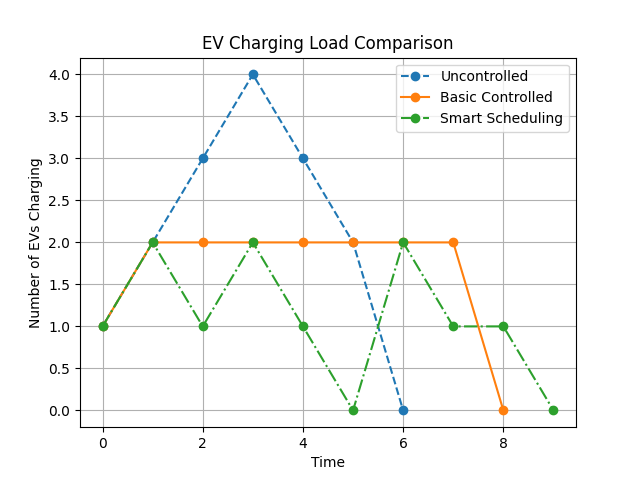
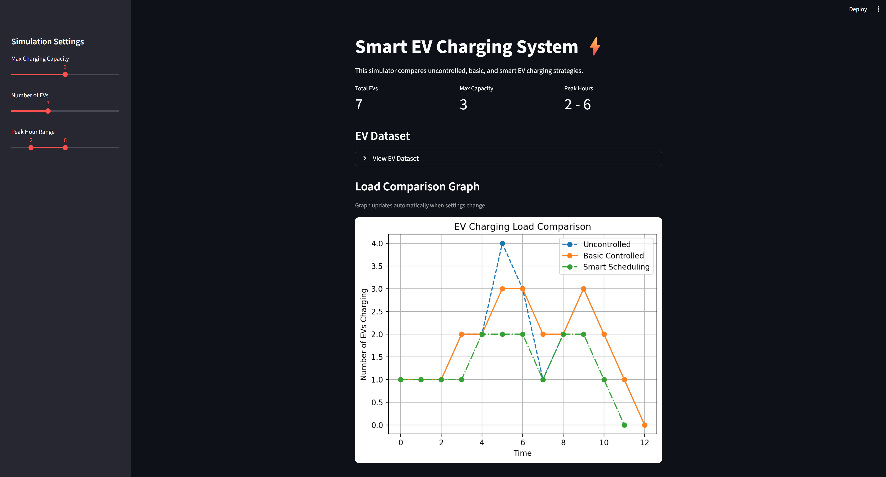

# Smart EV Charging System ⚡

A Python-based simulation project that demonstrates intelligent scheduling of Electric Vehicle (EV) charging to reduce peak power demand on the grid.

## Overview

This project simulates multiple EVs arriving at different times and compares different charging strategies through an interactive Streamlit dashboard:

- Uncontrolled Charging
- Basic Controlled Charging
- Smart Scheduling with Priority and Peak-Hour Logic
- Interactive Streamlit dashboard
- Dynamic EV dataset generation
- Adjustable charging capacity
- Adjustable peak-hour range

The system helps demonstrate how smart charging can improve load distribution and reduce peak demand.

---

## Features

- EV arrival and charging simulation
- Charging capacity limitation
- Priority-based scheduling
- Peak-hour load management
- Comparative load analysis
- Load vs. Time graph visualization

---

## Scheduling Methods

### 1. Uncontrolled Charging
All EVs begin charging immediately after arrival.

### 2. Basic Controlled Charging
Limits the number of EVs charging simultaneously.

### 3. Smart Scheduling
Uses:
- Preemptive scheduling
- Departure-time priority
- Peak-hour charging control

---

## Output Graph

The graph below compares all charging strategies.



---

## Dashboard Preview



---

## Technologies Used

- Python
- Streamlit
- Matplotlib

---

## How to Run

Run the main simulation file:

```bash
streamlit run app.py
```

---

## Future Improvements

- GUI/Web interface
- Real-time charging simulation
- Renewable energy integration
- Dynamic electricity pricing